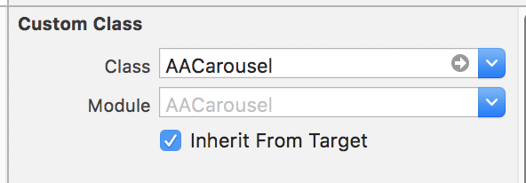
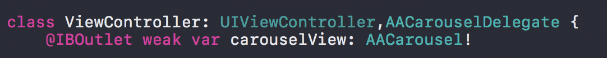

# AACarousel


#### Easy to create image slider in Swift


# Feature

- [x] pure swift 4.2 code
- [x] class is custom UIView , not UIPageViewController
- [x] you can download image use iOS native SDK or other 3rd SDK 
- [x] require iOS 8 or later

#### Style One


#### Style Two


# Installation

#### CocoaPods

AACarousel is available through [CocoaPods](https://cocoapods.org/pods/AACarousel).

Simply add AACarousel to your `Podfile`.

```
pod 'AACarousel'
```
Enter command instruction into your terminal.

```
pod install
```
#### Carthage

AACarousel is available through [Carthage](https://github.com/Carthage/Carthage).

Simply add AACarousel to your `Cartfile`.

```
github "Alan881/AACarousel"
```
Enter command instruction into your terminal.

```
carthage update --platform iOS
```

# Usage

You must create UIView and it use custom class in the storyboard after install AACarousel.



Then you must also create a IBOutlet in your UIViewController Class with AACarouselDelegate.



The following sample code for your reference.

```swift
    var titleArray = [String]()
    
    override func viewDidLoad() {
        super.viewDidLoad()
     
        let pathArray = ["http://www.gettyimages.ca/gi-resources/images/Embed/new/embed2.jpg",
                        "https://ak.picdn.net/assets/cms/97e1dd3f8a3ecb81356fe754a1a113f31b6dbfd4-stock-photo-photo-of-a-common-kingfisher-alcedo-atthis-adult-male-perched-on-a-lichen-covered-branch-107647640.jpg",
                        "https://imgct2.aeplcdn.com/img/800x600/car-data/big/honda-amaze-image-12749.png",
                        "http://www.conversion-uplift.co.uk/wp-content/uploads/2016/09/Lamborghini-Huracan-Image-672x372.jpg",
                        "very-large-flamingo"]
        titleArray = ["picture 1","picture 2","picture 3","picture 4","picture 5"]
        carouselView.delegate = self
        carouselView.setCarouselData(paths: pathArray,  describedTitle: titleArray, isAutoScroll: true, timer: 5.0, defaultImage: "defaultImage")
        //optional methods
        carouselView.setCarouselOpaque(layer: false, describedTitle: false, pageIndicator: false)
        carouselView.setCarouselLayout(displayStyle: 0, pageIndicatorPositon: 5, pageIndicatorColor: nil, describedTitleColor: nil, layerColor: nil)
    }
```

```swift
    //require method
    func downloadImages(_ url: String, _ index: Int) {
        
        //here is download images area
         let imageView = UIImageView()
        imageView.kf.setImage(with: URL(string: url)!, placeholder: UIImage.init(named: "defaultImage"), options: [.transition(.fade(0))], progressBlock: nil, completionHandler: { (downloadImage, error, cacheType, url) in
            self.carouselView.images[index] = downloadImage!
        })
    }
```

```swift
    //optional method (interaction for touch image)
    func didSelectCarouselView(_ view: AACarousel ,_ index: Int) {
        
        let alert = UIAlertView.init(title:"Alert" , message: titleArray[index], delegate: self, cancelButtonTitle: "OK")
        alert.show()
        
        //startAutoScroll()
        //stopAutoScroll()
    }
    
    //optional method (show first image faster during downloading of all images)
    func callBackFirstDisplayView(_ imageView: UIImageView, _ url: [String], _ index: Int) {
        
        imageView.kf.setImage(with: URL(string: url[index]), placeholder: UIImage.init(named: "defaultImage"), options: [.transition(.fade(1))], progressBlock: nil, completionHandler: nil)
        
    }
    
    func startAutoScroll() {
       //optional method
       carouselView.startScrollImageView()
        
    }
    
    func stopAutoScroll() {
        //optional method
        carouselView.stopScrollImageView()
    }

```

# License

AACarousel is available under the MIT license. See the LICENSE file for more info.
